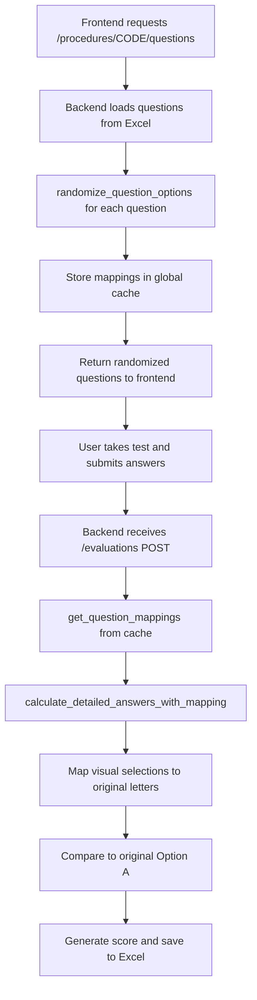

# InemecTest Backend: Question Randomization and Answer Evaluation Analysis

## Overview

This document provides a comprehensive analysis of how the InemecTest backend handles question randomization and answer evaluation, including the exact flow from question delivery to scoring.

## 1. Question Randomization Process (`/procedures/{code}/questions` endpoint)

### Location: `/src/api.py` lines 222-265

### Key Functions:

#### `randomize_question_options()` (lines 28-57)
- **Purpose**: Randomizes the order of question options (A, B, C, D) while preserving correct answer mapping
- **Input**: Original question dictionary with fixed options
- **Process**:
  1. Creates list of options with original letters: `[("A", option_a_text), ("B", option_b_text), ...]`
  2. Uses `random.shuffle()` to randomize the order
  3. Creates **inverse mapping**: maps visual position to original letter
- **Output**: 
  - `QuestionForUser` object with randomized options
  - Inverse mapping dictionary (e.g., `{"A": "C", "B": "A", "C": "D", "D": "B"}`)

#### `store_question_mappings()` (lines 63-69)
- **Purpose**: Stores the randomization mappings in a global cache
- **Storage**: Uses global `question_mappings_cache` dictionary
- **Key Format**: `"{procedure_codigo}_mappings"`
- **Data Stored**:
  - Original questions data
  - Mapping dictionaries for each question ID

### Endpoint Flow:
```python
@router.get("/procedures/{codigo}/questions")
async def get_procedure_questions(codigo: str):
    # 1. Verify procedure exists
    # 2. Get original questions from Excel
    # 3. For each question:
    #    - Randomize options using randomize_question_options()
    #    - Store mapping in mappings dict
    # 4. Store all mappings in global cache
    # 5. Return randomized questions to frontend
```

## 2. Randomization Mapping Storage

### Global Cache Structure:
```python
question_mappings_cache = {
    "PROC001_mappings": {
        "questions": [original_question_objects],
        "mappings": {
            1: {"A": "C", "B": "A", "C": "D", "D": "B"},  # question_id: visual->original
            2: {"A": "B", "B": "D", "C": "A", "D": "C"},
            # ... more questions
        }
    }
}
```

### Key Points:
- **Cache Key**: `{procedure_codigo}_mappings`
- **Mapping Direction**: Visual position (what user sees) → Original letter
- **Example**: If user selects "A" but the mapping is `{"A": "C"}`, the user actually selected original option C

## 3. Answer Evaluation Process (`/evaluations` endpoint)

### Location: `/src/api.py` lines 271-341

### Key Functions:

#### `get_question_mappings()` (lines 71-77)
- **Purpose**: Retrieves stored mappings from cache
- **Returns**: Original questions data and mappings dictionary

#### `calculate_detailed_answers_with_mapping()` (lines 79-137)
- **Purpose**: Core evaluation function that applies randomization mappings
- **Process**:
  1. **Receives**: User answers with visual positions (A, B, C, D as seen on screen)
  2. **Maps**: Visual selection to original letter using stored mappings
  3. **Evaluates**: Compares mapped selection to correct answer (always "A" in original)
  4. **Determines**: If answer is correct based on original mapping

### Critical Logic (lines 98-108):
```python
# User selected visual position (what they saw)
visual_position = answer["selected_option"]  # e.g., "B"

# Get mapping for this question
question_mapping = mappings.get(question_id, {})

# Convert visual position to original letter
original_selected = question_mapping.get(visual_position, visual_position)
# e.g., if mapping is {"B": "A"}, then original_selected = "A"

# Correct answer is always A in original data
correct_option = "A"
is_correct = original_selected == correct_option
```

### Answer Structure Generated:
```python
detailed_answer = {
    "question_id": question_id,
    "question_text": question["question_text"],
    "selected_option": visual_position,      # What user saw and clicked
    "selected_text": option_map.get(original_selected, ""),
    "correct_option": visual_correct,        # Visual position of correct answer
    "correct_text": option_map.get("A", ""), # Always option_a text
    "is_correct": is_correct
}
```

## 4. Critical Architecture Details

### Question Structure in Excel:
- **Column A**: Procedure code
- **Column B**: Question text
- **Column C**: Option A (ALWAYS THE CORRECT ANSWER)
- **Column D**: Option B 
- **Column E**: Option C
- **Column F**: Option D

### Randomization Principle:
- Option A from Excel is always correct
- Randomization shuffles visual positions
- Mapping tracks which visual position corresponds to original Option A

### Evaluation Principle:
- User selection (visual) → Mapped to original letter → Compared to "A"
- Score calculation based on original Option A matches

## 5. Potential Issues Identified

### 1. Cache Management
- **Issue**: Global cache `question_mappings_cache` is in-memory only
- **Risk**: Lost on server restart, not shared across instances
- **Impact**: If mappings are lost, evaluation will fail or be incorrect

### 2. Concurrent User Sessions
- **Issue**: Cache uses procedure code as key, not session-specific
- **Risk**: Multiple users taking same procedure could overwrite mappings
- **Impact**: Wrong scoring for concurrent users

### 3. Cache Key Collision
- **Issue**: Same procedure code generates same cache key
- **Risk**: User A's randomization could be overwritten by User B
- **Impact**: User A might be scored against User B's randomization

### 4. Error Handling
- **Issue**: Limited fallback when mappings are missing (lines 287-295)
- **Fallback**: Creates identity mapping `{"A": "A", "B": "B", ...}`
- **Risk**: Assumes no randomization occurred, may score incorrectly

## 6. Data Flow Summary



## 7. Recommendations

### Immediate Fixes:
1. **Session-Based Caching**: Use session IDs in cache keys
2. **Persistent Storage**: Store mappings in database/Excel instead of memory
3. **Better Error Handling**: Robust fallbacks when mappings are missing
4. **Concurrent Safety**: Ensure thread-safe cache operations

### Long-term Improvements:
1. **Database Integration**: Move from Excel to proper database
2. **Session Management**: Implement proper user session handling
3. **Audit Trail**: Log all randomization and evaluation events
4. **Testing**: Comprehensive unit tests for randomization logic

## 8. Current Workaround Solutions

The system currently works for single-user scenarios where:
1. User requests questions (mappings stored)
2. User immediately completes evaluation (mappings still in cache)
3. No concurrent users taking same procedure
4. Server doesn't restart between question request and evaluation

For production use, the caching mechanism needs significant improvement to handle concurrent users and persistent storage.